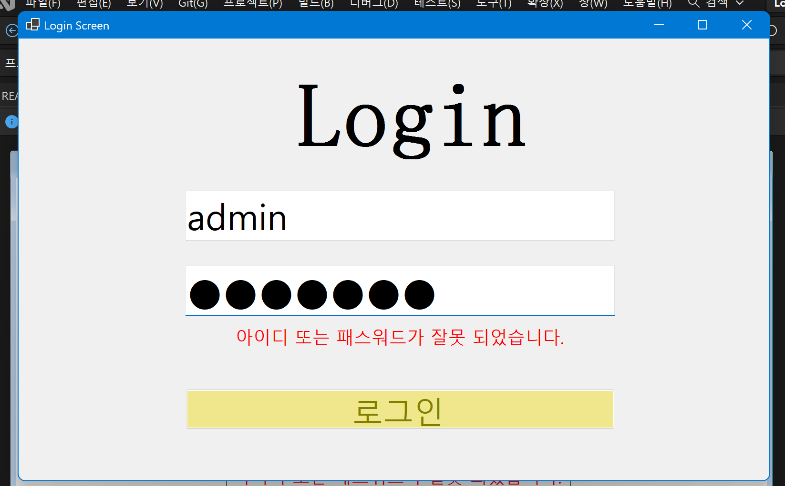

# (C# 코딩) 로그인

## 개요
- C# 프로그래밍 학습
- 1줄 소개: 사용자 키보드 입력을 받아서 처리하는 프로그램
- 사용한 플랫폼: - C#, .NET Windows Forms, Visual Studio, GitHub
- 사용한 컨트롤:
- Label, TextBox, Button
- 사용한 기술과 구현한 기능:
- - Visual Studio를 이용하여 UI 디자인
-
- 실습 중에 구현한 기능들 설명:

## 실행 화면 (과제1)- 과제1 코드의 실행 스크린샷

- 과제 내용
- Label 1개, TextBox 2개, Button 1개를 사용하여 로그인 화면의 기본 UI를 구성하였습니다.
- 아이디와 비밀번호 입력창에 Placeholder를 표시하여 사용자가 입력해야 할 내용을 안내하도록 구현하였습니다.
- 아이디와 패스워드가 모두 올바를 때만 로그인 성공으로 처리되도록 구현하였습니다.
- 로그인 버튼 클릭 시 성공 또는 실패 MessageBox가 표시되도록 구현하였습니다.

- 구현 내용과 기능 설명
- 상단에는 로그인 화면 제목을 표시하는 Label을 배치하였습니다.
- 첫 번째 TextBox는 아이디 입력창으로 사용하고, 두 번째 TextBox는 비밀번호 입력창으로 사용하였습니다.
- 비밀번호 입력창은 입력한 내용이 그대로 보이지 않도록 비밀번호 마스킹 처리를 적용하였습니다.
- 로그인 버튼을 클릭하면 입력된 아이디와 비밀번호를 미리 정한 값과 비교하도록 구현하였습니다.
- 아이디와 비밀번호가 모두 일치할 경우 로그인 성공 메시지 박스가 출력되도록 하였습니다.
- 아이디 또는 비밀번호가 하나라도 일치하지 않을 경우 로그인 실패 메시지 박스가 출력되도록 하였습니다.
- 기본적인 로그인 화면 구성과 입력값 검사 흐름을 연습할 수 있었습니다.

## 실행 화면 (과제2)- 과제2 코드의 실행 스크린샷

- 과제 내용
- 아이디 입력 후 Enter 키를 누르면 패스워드 입력창으로 이동하도록 구현하였습니다.
- 패스워드 입력 후 Enter 키를 누르면 로그인 버튼을 클릭한 것과 같은 동작이 실행되도록 구현하였습니다.
- MessageBox를 사용하지 않고, 아이디와 패스워드를 입력하는 영역에 로그인 결과 메시지가 표시되도록 구현하였습니다.
- Label 컨트롤을 추가하여 로그인 성공 또는 실패 메시지를 화면에 표시하도록 구성하였습니다.
- Visible 속성을 이용하여 메시지를 필요할 때만 보이거나 숨길 수 있도록 구현하였습니다.

- 구현 내용과 기능 설명
- 아이디 입력창에서 Enter 키 입력을 감지하여 패스워드 입력창으로 포커스가 이동하도록 처리하였습니다.
- 패스워드 입력창에서 Enter 키 입력 시 로그인 버튼 클릭 이벤트가 실행되도록 구성하여 키보드만으로 로그인할 수 있도록 구현하였습니다.
- 기존의 MessageBox 출력 방식 대신 Label 컨트롤을 사용하여 결과 메시지가 화면 내부에 표시되도록 변경하였습니다.
- 로그인 성공 시 성공 메시지가 표시되고, 로그인 실패 시 실패 메시지가 표시되도록 구현하였습니다.
- 평소에는 결과 메시지가 보이지 않도록 하고, 로그인 시도 시에만 Visible 속성을 변경하여 메시지가 나타나도록 처리하였습니다.
- 키보드 중심의 입력 흐름과 화면 내 피드백 방식을 적용하여 로그인 화면의 사용 편의성을 높일 수 있었습니다.